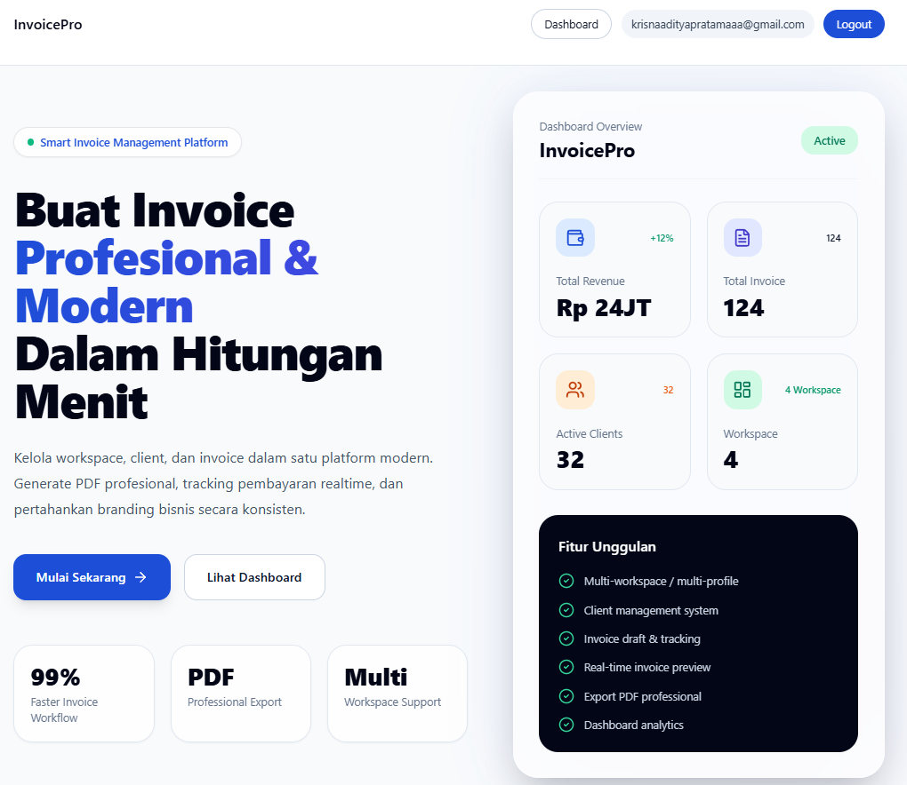
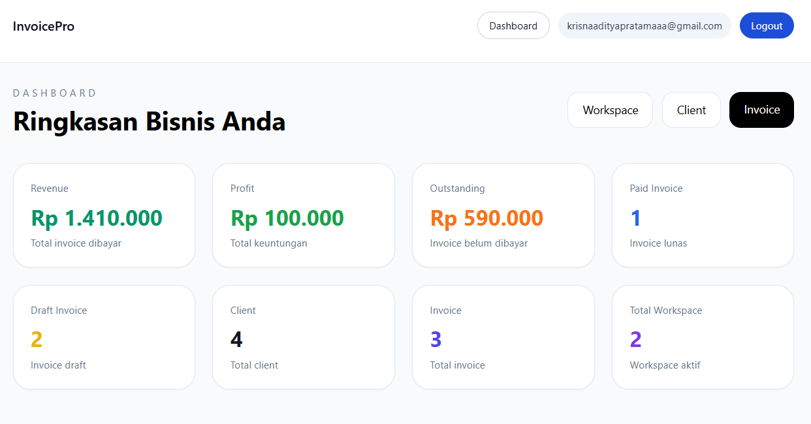
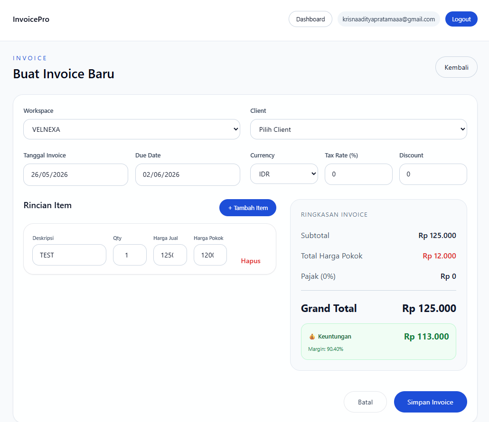
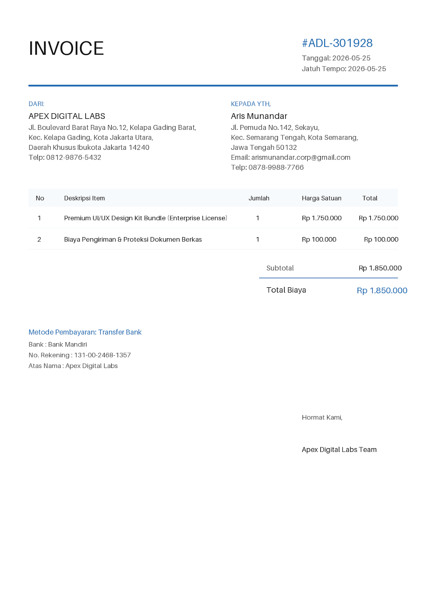

# 📋 InvoicePro - Platform Manajemen Invoice & Profit Tracking

<div align="center">


**Aplikasi web modern untuk membuat, mengelola invoice, dan melacak keuntungan bisnis Anda dengan mudah**

[🌐 Fitur](#-fitur-lengkap) • [📦 Instalasi](#-instalasi-lengkap) • [⚙️ Konfigurasi](#️-konfigurasi-environment-variables) • [🚀 Quick Start](#-quick-start) • [📸 Screenshot](#-screenshots)

</div>

---

## 🎯 Tentang InvoicePro

InvoicePro adalah aplikasi web yang dirancang khusus untuk **entrepreneur, reseller, dan pemilik usaha** yang membutuhkan sistem profesional untuk:
- ✅ Mengelola klien bisnis
- ✅ Membuat dan mengirim invoice
- ✅ **Melacak keuntungan sebenarnya** (harga jual vs harga pokok)
- ✅ Mengelola multiple workspaces/bisnis
- ✅ Mengekspor invoice ke PDF
- ✅ Membuat laporan profit tracking

---

## ✨ Fitur Lengkap

### 1. **🔐 Autentikasi & Profil Pengguna**
- Registrasi dan login aman menggunakan Supabase Auth
- Profil pengguna dengan avatar dan informasi kontak
- Manajemen data pengguna yang aman

### 2. **🏢 Multi-Workspace (Workspace Management)**
- Buat multiple bisnis dalam satu akun
- Setiap workspace memiliki data terpisah
- Konfigurasi custom:
  - 📛 Nama workspace dan logo
  - 🏦 Informasi bank (nama, rekening, swift code)
  - 💱 Pilih currency (IDR, USD, EUR, etc.)
  - 📧 Email dan telepon bisnis
  - 🖋️ Nama penandatangan (untuk invoice)

### 3. **👥 Manajemen Klien**
- Tambah, edit, hapus klien
- Simpan informasi klien lengkap:
  - Nama, email, telepon
  - Perusahaan, alamat
  - Tax ID/NPWP
- Quick view semua klien dalam workspace

### 4. **📄 Invoice Management**
- ✏️ Buat invoice dengan item detail
- 📤 Ubah status invoice (Draft, Sent, Paid, Overdue)
- 📥 View, edit, hapus invoice
- 📊 Filter berdasarkan klien dan status
- 📄 Export ke PDF profesional
- 🗂️ Prefix nomor invoice yang custom

### 5. **💰 Advanced Profit Tracking System** ⭐
Fitur unggulan untuk melacak keuntungan sebenarnya:

#### **Harga Bertingkat (3-Level Pricing)**
Setiap item dalam invoice memiliki:
- **Harga Jual (Unit Price)** - Harga yang Anda jual ke customer
- **Harga Pokok (Cost Price)** - Harga yang Anda bayarkan ke vendor
- **Kuantitas** - Jumlah item

#### **Automatic Profit Calculation**
Sistem otomatis menghitung:
- **Profit per Item** = (Harga Jual - Harga Pokok) × Jumlah
- **Total Cost** = Total semua harga pokok
- **Total Profit** = Total Invoice - Pajak - Total Cost
- **Profit Margin %** = (Total Profit / Subtotal) × 100%

#### **Contoh Praktis**
```
Item: Ring Emas
- Jumlah: 2
- Harga Jual per item: Rp 1.400.000
- Harga Pokok per item: Rp 1.250.000
- Profit per item: Rp 150.000

Total Item:
- Subtotal: Rp 2.800.000
- Pajak: Rp 280.000
- Total Cost: Rp 2.500.000
- Total Profit: Rp 20.000 (Rp 2.800.000 - Rp 280.000 - Rp 2.500.000)
- Profit Margin: 0.71%

💡 Tanpa tracking ini, Anda akan kira profit Rp 2.800.000, 
   padahal sebenarnya hanya Rp 20.000!
```

### 6. **📊 Dashboard**
- Ringkasan invoice terbaru
- Statistik bisnis
- Quick action untuk membuat invoice/klien baru
- Visual data insights

### 7. **🎨 PDF Export**
- Export invoice ke PDF dengan format profesional
- Include informasi workspace (logo, bank, penandatangan)
- Otomatis generate invoice number

---

## 📊 Tech Stack

| Teknologi | Versi | Kegunaan |
|-----------|-------|----------|
| **Next.js** | 15.0.0 | Framework React & routing |
| **React** | 18.3.1 | UI components |
| **TypeScript** | 5.6.0 | Type safety |
| **Supabase** | 2.26.0 | Backend & database |
| **Tailwind CSS** | 3.4.4 | Styling |
| **React Hook Form** | 7.56.0 | Form management |
| **Zod** | 3.23.0 | Schema validation |
| **Zustand** | 4.4.0 | State management |
| **Lucide React** | 1.16.0 | Icons |
| **React PDF** | 4.5.1 | PDF generation |

---

## 📦 Instalasi Lengkap

### **Prasyarat**
Pastikan sudah install di komputer Anda:
- **Node.js** (versi 16+ disarankan 18+)
- **npm** atau **yarn**
- **Git**

### **Step 1: Clone Repository**
```bash
git clone https://github.com/yourusername/InvoicePro.git
cd InvoicePro
```

### **Step 2: Install Dependencies**
```bash
npm install
```

Ini akan install semua library dari `package.json`:
- next, react, react-dom
- @supabase/supabase-js
- react-hook-form, @hookform/resolvers
- zod, zustand
- lucide-react
- @react-pdf/renderer
- tailwindcss, postcss, autoprefixer
- typescript, @types/*

### **Step 3: Install Library Manual (Jika Diperlukan)**

Jika ada library yang perlu di-update atau tambahan:

```bash
# Form management
npm install react-hook-form @hookform/resolvers

# Validation
npm install zod

# State management
npm install zustand

# Icons
npm install lucide-react

# PDF Generation
npm install @react-pdf/renderer

# Supabase
npm install @supabase/supabase-js

# Styling (biasanya sudah ada)
npm install tailwindcss postcss autoprefixer
```

---

## ⚙️ Konfigurasi Environment Variables

### **Step 1: Setup Environment File**

Buat file `.env` (root project) dengan copy dari `.env.example`:

```bash
# Windows (PowerShell)
Copy-Item .env.example .env
```

**Atau buat file `.env`** (root project) manual dengan isi:
```env
NEXT_PUBLIC_SUPABASE_URL=https://xxxxxxxxxxxx.supabase.co
NEXT_PUBLIC_SUPABASE_ANON_KEY=eyJhbGciOiJIUzI1NiIsInR5cCI6IkpXVCJ9...
```

### **Step 2: Dapatkan Credentials dari Supabase**

Lihat bagian **Setup Supabase** di bawah untuk mendapatkan URL dan API Key.

---

## 🔧 Setup Supabase

Supabase adalah backend platform yang menyimpan semua data aplikasi.

### **1. Create Supabase Project**

1. Buka https://supabase.com
2. Sign up atau login
3. Klik **"New Project"**
4. Isi form:
   - **Name**: `InvoicePro` (atau sesuai keinginan)
   - **Database Password**: Simpan dengan aman ⚠️
   - **Region**: Pilih region terdekat (Asia Southeast 1 untuk Indonesia)
5. Tunggu project dibuat (±2-3 menit)

### **2. Setup Database Schema**

1. Di Supabase Dashboard, masuk ke **SQL Editor**
2. Klik **"New Query"**
3. Copy-paste seluruh isi dari file `supabase/schema.sql`:

```bash
# Atau buka: supabase/schema.sql di project Anda
```

4. Klik **"Run"** atau **Ctrl+Enter**
5. Schema database akan ter-create otomatis

### **3. Setup Row Level Security (RLS) Policies**

1. Di Supabase Dashboard, masuk ke **SQL Editor** (atau Auth → Policies)
2. Klik **"New Query"**
3. Copy-paste seluruh isi dari file `supabase/policies.sql`
4. Klik **"Run"**

**Tujuan RLS:** Memastikan setiap user hanya bisa akses data mereka sendiri.

### **4. Ambil API Credentials**

1. Di Supabase Dashboard, masuk ke **Settings → API**
2. Copy **Project URL** → paste ke `NEXT_PUBLIC_SUPABASE_URL` di `.env`
3. Copy **anon key** (bukan service role key) → paste ke `NEXT_PUBLIC_SUPABASE_ANON_KEY` di `.env`

**Contoh:**
```env
NEXT_PUBLIC_SUPABASE_URL=https://xyzabc.supabase.co
NEXT_PUBLIC_SUPABASE_ANON_KEY=eyJhbGciOiJIUzI1NiIsInR5cCI6IkpXVCJ9.eyJpc3M...
```

### **5. Setup Email Authentication (Opsional)**

1. Di Supabase, masuk ke **Auth → Providers**
2. Pastikan **Email** enabled (default sudah on)
3. Atur SMTP jika ingin email konfirmasi custom (opsional)

---

## 🚀 Quick Start

### **Jalankan Development Server**

```bash
npm run dev
```

Aplikasi akan berjalan di: **http://localhost:3000**

### **Langkah Pertama Setelah Setup**

1. ✅ Buka http://localhost:3000
2. 📝 **Register** akun baru → Lihat **Cara Membuat Akun** di bawah
3. 👤 Lengkapi **Profile** Anda
4. 🏢 Buat **Workspace** pertama (bisnis Anda)
5. 👥 Tambah **Klien** pertama
6. 📄 Buat **Invoice** pertama
7. 💰 Masukkan harga jual dan harga pokok
8. 📊 Lihat profit calculation otomatis
9. 📤 Export ke PDF

### **Cara Membuat Akun**

#### **Opsi 1: Via Aplikasi (Recommended)**

1. Buka http://localhost:3000
2. Klik tombol **"Daftar"** di navigation bar (atas kanan)
3. Isi form register:
   - **Email**: Masukkan email Anda
   - **Password**: Minimal 6 karakter
4. Klik **"Sign Up"**
5. ✅ Akun berhasil dibuat, langsung bisa login

#### **Opsi 2: Via Supabase Console (Manual)**

Jika ingin membuat akun langsung di Supabase tanpa melalui aplikasi:

1. Buka **Supabase Dashboard** → pilih project InvoicePro
2. Masuk ke **Auth → Users**
3. Klik **"Create New User"**
4. Isi form:
   - **Email**: Email akun yang ingin dibuat
   - **Password**: Password minimal 6 karakter
   - **Auto confirm user**: Centang ✓ (agar langsung bisa login)
5. Klik **"Create User"**
6. ✅ Akun berhasil dibuat, bisa langsung login di aplikasi

**Catatan:** Saat pertama login, Anda akan diminta melengkapi profile (nama, telepon, dll).

---

## 📁 Struktur Folder Project

```
InvoicePro/
├── app/                           # Next.js App Directory
│   ├── layout.tsx                 # Layout utama
│   ├── page.tsx                   # Landing page
│   ├── globals.css                # Global styles
│   ├── login/                     # Login page
│   ├── register/                  # Register page
│   ├── dashboard/                 # Dashboard page
│   ├── clients/                   # Client management
│   │   ├── page.tsx               # List clients
│   │   ├── [id]/page.tsx          # View client
│   │   ├── new/page.tsx           # Create client
│   │   └── edit/[id]/page.tsx     # Edit client
│   ├── invoices/                  # Invoice management
│   │   ├── page.tsx               # List invoices
│   │   ├── [id]/page.tsx          # View invoice
│   │   ├── new/page.tsx           # Create invoice ⭐ PROFIT TRACKING
│   │   └── edit/[id]/page.tsx     # Edit invoice
│   └── workspaces/                # Workspace management
│       ├── page.tsx               # List workspaces
│       ├── [workspaceId]/[id]/    # View workspace
│       ├── new/page.tsx           # Create workspace
│       └── edit/[id]/page.tsx     # Edit workspace
├── components/                    # Reusable components
│   ├── Header.tsx                 # Navigation header
│   ├── ClientCard.tsx             # Client card component
│   ├── InvoiceCard.tsx            # Invoice card component
│   ├── WorkspaceCard.tsx          # Workspace card component
│   └── InvoicePdfDocument.tsx     # PDF template
├── lib/                           # Utility functions
│   ├── supabaseClient.ts          # Supabase config
│   ├── types.ts                   # TypeScript types
│   └── userSetup.ts               # User initialization
├── store/                         # State management (Zustand)
│   └── appStore.ts                # Global app state
├── supabase/                      # Supabase config
│   ├── schema.sql                 # Database schema
│   └── policies.sql               # RLS policies
├── img/                           # Screenshots & images
│   ├── landingpage.png            # Landing page screenshot
│   ├── dashboard.png              # Dashboard screenshot
│   ├── workspace.png              # Workspace screenshot
│   ├── client.png                 # Client page screenshot
│   ├── invoice.png                # Invoice page screenshot
│   └── addinvoice.png             # Add invoice screenshot
├── .env                          # Environment variables (JANGAN PUSH)
├── .env.example                   # Template env untuk referensi tim
├── .gitignore                     # Git ignore rules
├── package.json                   # Dependencies
├── package-lock.json              # Dependency lock
├── tsconfig.json                  # TypeScript config
├── next.config.mjs                # Next.js config
├── tailwind.config.ts             # Tailwind CSS config
├── postcss.config.js              # PostCSS config
└── README.md                      # File ini
```

---

## 📚 Database Schema Penjelasan

### **1. Profiles Table**
Menyimpan informasi pengguna:
- `id` - User ID dari Supabase Auth
- `full_name` - Nama lengkap
- `avatar_url` - URL foto profil
- `phone`, `company` - Kontak info

### **2. Workspaces Table**
Menyimpan data workspace (bisnis):
- `id` - Workspace unique ID
- `owner_id` - Reference ke profile (pemilik)
- `name`, `slug` - Nama workspace
- `logo_url` - Logo bisnis
- `prefix` - Prefix invoice (misal: "INV", "PO", etc.)
- `currency` - Currency default (IDR, USD, dll)
- **Bank info**: `bank_name`, `bank_account`, `bank_swift`
- **Signer**: `signer_name` (untuk tanda tangan di invoice)

### **3. Clients Table**
Menyimpan data klien:
- `id` - Client unique ID
- `workspace_id` - Reference ke workspace
- `name`, `email`, `phone` - Kontak klien
- `company`, `address` - Info perusahaan
- `tax_id` - NPWP atau tax ID

### **4. Invoices Table** ⭐ Profit Tracking
Menyimpan invoice dengan profit tracking:
- `id` - Invoice unique ID
- `workspace_id`, `client_id` - References
- `invoice_number` - Nomor invoice (unique)
- `issue_date`, `due_date` - Tanggal
- `status` - Draft, Sent, Paid, Overdue
- `currency` - Currency invoice
- **Pricing Fields:**
  - `subtotal` - Total sebelum pajak
  - `tax` - Pajak
  - `discount` - Diskon
  - `total` - Total setelah pajak & diskon (HARGA JUAL)
  - `total_cost` - Total harga pokok (BARU!)
- **Profit Fields (CALCULATED):**
  - `total_profit` = total - tax - total_cost
  - `profit_margin` = (total_profit / subtotal) × 100%

### **5. Invoice Items Table**
Menyimpan item dalam invoice:
- `id` - Item unique ID
- `invoice_id` - Reference ke invoice
- `description` - Deskripsi item
- `quantity` - Jumlah
- **Pricing:**
  - `unit_price` - Harga jual per unit
  - `cost_price` - Harga pokok per unit (BARU!)
- **Calculated Fields:**
  - `total` = quantity × unit_price
  - `profit` = quantity × (unit_price - cost_price)

---

## 💡 Cara Menggunakan Profit Tracking

### **Scenario 1: Reseller Barang**
```
Anda reseller jam tangan:
1. Harga jual ke customer: Rp 500.000
2. Harga pokok dari supplier: Rp 350.000
3. Profit per pcs: Rp 150.000 (30% margin)

Saat membuat invoice:
- Description: Jam Tangan Diorama Premium
- Quantity: 3
- Unit Price (Harga Jual): Rp 500.000
- Cost Price (Harga Pokok): Rp 350.000

System otomatis hitung:
- Subtotal: Rp 1.500.000
- Profit per item: Rp 150.000 × 3 = Rp 450.000
- Profit Margin: 30%

Tanpa tracking: Kira-kira profit Rp 1.500.000 ❌
Dengan tracking: Profit sebenarnya Rp 450.000 ✅
```

### **Scenario 2: Jasa dengan Cost**
```
Anda penyedia jasa desain grafis:
1. Harga jual design: Rp 2.000.000
2. Cost (freelancer, software): Rp 800.000
3. Profit: Rp 1.200.000 (60% margin)

Saat membuat invoice:
- Description: Desain Logo Brand (3 revisi)
- Quantity: 1
- Unit Price: Rp 2.000.000
- Cost Price: Rp 800.000

System otomatis hitung:
- Subtotal: Rp 2.000.000
- Total Cost: Rp 800.000
- Total Profit: Rp 1.200.000
- Profit Margin: 60%
```

---

## 🎨 Screenshots

### **1. Landing Page**

*Halaman awal dengan informasi aplikasi dan call-to-action*

### **2. Dashboard**

*Dashboard dengan ringkasan invoice, statistik, dan quick actions*

### **3. Workspace Management**

*Kelola multiple bisnis dalam satu akun dengan konfigurasi custom*

### **4. Client Management**

*List dan kelola semua klien Anda dengan detail lengkap*

### **5. Invoice List**

*Daftar invoice dengan status, filter, dan quick actions*

### **6. Create/Edit Invoice** ⭐

*Form invoice dengan 4 input field per item untuk profit tracking:*
- *Deskripsi*
- *Jumlah (Quantity)*
- *Harga Jual (Unit Price)*
- *Harga Pokok (Cost Price) - FITUR BARU*

### **7. Invoice PDF Export**

*Export invoice ke format PDF profesional dengan informasi workspace, klien, dan detail perhitungan profit*

---

## 🚀 Build & Deployment

### **Production Build**
```bash
npm run build
npm run start
```

### **Deploy ke Vercel (Recommended)**
1. Push ke GitHub
2. Buka https://vercel.com
3. Import repository
4. Setup environment variables di Vercel
5. Deploy otomatis

---

## 📖 Useful Commands

```bash
# Development
npm run dev           # Jalankan dev server (http://localhost:3000)

# Build
npm run build         # Build untuk production
npm run start         # Run production build

# IDE
code .               # Buka di VS Code (jika installed)

# Git
git add .
git commit -m "Your message"
git push

# Database (jika pakai Supabase CLI)
npx supabase start
npx supabase stop
```

---

## ⚠️ Important Security Tips

1. **JANGAN COMMIT `.env`** ke GitHub
   - Sudah aman di `.gitignore`
   - Hanya commit `.env.example` untuk referensi tim
   - Copy `.env.example` ke `.env` untuk development

2. **Jangan share Supabase credentials** ke publik
   - `NEXT_PUBLIC_SUPABASE_URL` ok (publik)
   - `NEXT_PUBLIC_SUPABASE_ANON_KEY` ok (limited access)
   - Service role key ⚠️ JANGAN SHARE

3. **Update .env di server/production**
   - Set via environment variables
   - Jangan hardcode

4. **Enable RLS di Supabase**
   - Pastikan policies.sql sudah dijalankan
   - User hanya bisa akses data mereka

---

## 🐛 Troubleshooting

### **Error: "Failed to fetch data from Supabase"**
- ✅ Check `.env` sudah ada dan benar di root project
- ✅ Copy `.env.example` ke `.env` jika belum ada
- ✅ Check internet connection
- ✅ Verify Supabase URL dan API key di `.env`

### **Error: "Cannot find module 'lucide-react'"**
- ✅ Run: `npm install lucide-react`

### **Error: "Port 3000 already in use"**
- ✅ Run di port lain: `npm run dev -- -p 3001`

### **Invoice PDF tidak muncul**
- ✅ Check: `@react-pdf/renderer` sudah ter-install
- ✅ Run: `npm install @react-pdf/renderer`

### **Database error saat buat invoice**
- ✅ Pastikan `supabase/schema.sql` sudah dijalankan
- ✅ Pastikan `supabase/policies.sql` sudah dijalankan
- ✅ Check Supabase connection

---

## 📝 Panduan Kontribusi

Ingin berkontribusi? Silakan:
1. Fork repository
2. Create branch fitur: `git checkout -b feature/amazing-feature`
3. Commit changes: `git commit -m 'Add amazing feature'`
4. Push: `git push origin feature/amazing-feature`
5. Open Pull Request

---

## 📄 License

Proyek ini under **MIT License**. Silakan gunakan, modifikasi, dan distribusikan sesuai kebutuhan.

---

## 💬 Support & Contact

- 📧 Email: support@invoicepro.com
- 💬 Issues: GitHub Issues
- 📚 Documentation: [Link ke docs]

---

## 🎉 Credits

Built with ❤️ using:
- **Next.js** - React framework
- **Supabase** - Open source Firebase alternative
- **Tailwind CSS** - Utility-first CSS
- **TypeScript** - Type-safe JavaScript

---

<div align="center">

**Made with 💚 for Indonesian entrepreneurs**

Give us a ⭐ if this project helps you!

</div>
